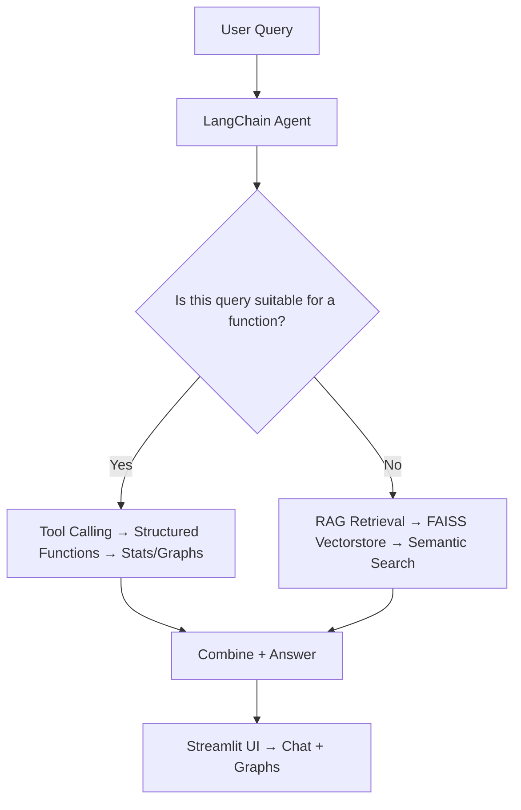

# 🏏 GenAI IPL App

## 📌 Project Introduction

Traditional cricket websites provide rich statistics about leagues and matches, but they lack an interactive **chat-based Q&A system**.  
For example, users cannot directly ask:  
👉 *“Who scored the fastest fifty at Wankhede in 2016?”*  

This project fills that gap by building a **RAG-based GenAI application** that combines:

- **Manual Analysis Dashboards** → Interactive tables & graphs for IPL stats.  
- **GenAI Chat Assistant** → Natural language Q&A powered by LLM + RAG.

---
## 📺 Demo Video
🎥 Watch the working demo here: [YouTube Link](https://www.youtube.com/watch?v=tatqkjaBtRQ) 

## 🔎 Features

### 1️⃣ Manual Analysis Dashboards
Users can explore IPL history through structured, interactive analysis:

- 📊 **Overall IPL Analysis** → Teams, winners, historical trends  
- 🏏 **Team Analysis** → Player-wise batting & bowling breakdowns  
- 👥 **Player Summary** → Career stats in tables & graphs  
- ⚔️ **Player vs Bowler** → Head-to-head records  
- 🆚 **Team vs Team** → Comparative match history  
- 🏆 **Leaderboards** → Top performers by season  
- 🏟️ **Venue Analysis** → Matches, 4s/6s, top performers  
- 🔄 **Player Comparison** → Compare two players’ stats  
- 🎯 **Tournament Summary** → Champions, top batsmen & bowlers  

👉 These are **deterministic, structured functions** ensuring accuracy.

---

### 2️⃣ GenAI Chat Assistant

A conversational agent that answers **simple, tricky, and complex IPL queries**.

#### 🔹 Hybrid Design
- ✅ **Structured queries** → Handled by Python functions (e.g., player summary, venue analysis).  
- ✅ **Unstructured queries** → Handled by **RAG** over curated CSVs.  

#### 🔹 Data Preparation
- Extracted IPL dataset from Kaggle.  
- Created **15 specialized CSVs** (batting stats, bowling stats, partnerships, playoffs, venues, etc.).  
- Generated embeddings using **OpenAI `text-embedding-3-large`**.  
- Stored embeddings in **FAISS vector database** for semantic retrieval.  

#### 🔹 Query Flow
1. User enters query → *“How many sixes did Rohit Sharma hit in 2017?”*  
2. Tool Router decides:
   - Structured → Use Python function.  
   - Unstructured → Use RAG.  
3. Selected tool executes → sends result to LLM → generates answer.  
4. Response displayed in chatbot UI.  

---

## ⚙️ Tech Stack & Architecture

- **LLM & Embeddings** → OpenAI GPT models (`text-embedding-3-large`)  
- **Framework** → LangChain (tool routing, RAG pipeline)  
- **Database** → FAISS (vector store for embeddings)  
- **Frontend/UI** → Streamlit  
- **Backend Logic** → Python tools for structured queries  

---

## 🚀 Query Flow



---

## 📂 Final Folder Structure – GenAI IPL App

```plaintext
ipl_genai_app/
├── Chatbot/
│   ├── llm.py                 # Load OpenAI model
│   ├── agent.py               # LangChain agent setup (tools + RAG)
│   ├── tools.py               # Tool wrappers (calls your IPL functions)
│   └── gen_chat.py            # Chat interface where users ask queries
│
├── requirements.txt           # 📦 Dependencies
│
├── ipl_dataset/
│   ├── final_ipl.csv          # 🔢 Main IPL dataset
│   ├── player_info.csv        # 👤 Player profile data
│   ├── vectorstore/           # FAISS embeddings DB
│   └── rag_knowledgebase/     # CSVs for RAG (15 curated datasets)
│
├── ipl_player/                # Player images
│
├── RAG_helper/                # Helpers for RAG pipelines
│   ├── retriever.py           # CSV/text loader and retriever setup
│   └── (other helper scripts for stats, matches, venues, etc.)
│
├── src/                       # 🔧 Core IPL business logic
│   ├── functional_tool/       # Structured tool logic
│   ├── player_summary.py
│   ├── team_vs_team.py
│   ├── venue_analysis.py
│   ├── overview.py
│   ├── tournament_summary.py
│   └── utils.py               # Shared utilities
│
├── venue_images/              # Venue thumbnails
│
└── final_app.py               # Final Streamlit app entrypoint
```

---

## ⚙️ Installation & Setup

1. Clone the repository:  
   ```bash
   git clone https://github.com/hitesh2204/IPL_Analysis_Dashbord.git
   ```

2. Install dependencies:  
   ```bash
   pip install -r requirements.txt
   ```

3. Run the Streamlit app:  
   ```bash
   streamlit run final_app.py
   ```
---

## 🎯 Features

- ✅ Chat-based Q&A over IPL stats & matches  
- ✅ Combines **structured tools + RAG retrieval**  
- ✅ Rich visualizations (graphs, stats tables, player analysis)  
- ✅ Powered by **LangChain + FAISS + OpenAI**  

---

## 📊 Example Queries

- *"Who has the best strike rate at Chinnaswamy Stadium?"*  
- *"Show me Rohit Sharma’s career summary"*  
- *"Which team won most matches in 2019?"*  

---

