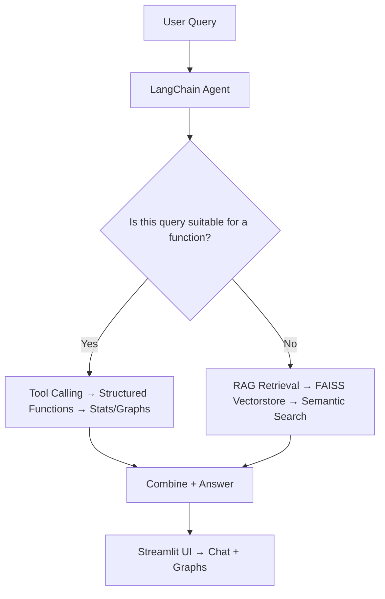

# 🏏 GenAI IPL App

## 📌 Project Introduction

Traditional cricket websites provide rich statistics about leagues and matches, but lack a chat-based Q&A system.  
With **GenAI IPL App**, users can ask natural questions like:  
👉 *“Who scored the fastest fifty at Wankhede in 2016?”*  
and get instant answers with **stats, graphs, and insights** powered by **LangChain + RAG + LLMs**.

---

## 🚀 Query Flow



---

## 📂 Final Folder Structure – GenAI IPL App

```plaintext
ipl_genai_app/
├── Chatbot/
│   ├── llm.py                 # Load OpenAI model
│   ├── agent.py               # LangChain agent setup (tools + RAG)
│   ├── tools.py               # Tool wrappers (calls your IPL functions)
│   └── gen_chat.py            # Chat interface where users ask queries
│
├── requirements.txt           # 📦 Dependencies
│
├── ipl_dataset/
│   ├── final_ipl.csv          # 🔢 Main IPL dataset
│   ├── player_info.csv        # 👤 Player profile data
│   ├── vectorstore/           # FAISS embeddings DB
│   └── rag_knowledgebase/     # CSVs for RAG (15 curated datasets)
│
├── ipl_player/                # Player images
│
├── RAG_helper/                # Helpers for RAG pipelines
│   ├── retriever.py           # CSV/text loader and retriever setup
│   └── (other helper scripts for stats, matches, venues, etc.)
│
├── src/                       # 🔧 Core IPL business logic
│   ├── functional_tool/       # Structured tool logic
│   ├── player_summary.py
│   ├── team_vs_team.py
│   ├── venue_analysis.py
│   ├── overview.py
│   ├── tournament_summary.py
│   └── utils.py               # Shared utilities
│
├── venue_images/              # Venue thumbnails
│
└── final_app.py               # Final Streamlit app entrypoint
```

---

## ⚙️ Installation & Setup

1. Clone the repository:  
   ```bash
   git clone https://github.com/your-username/genai-ipl-app.git
   cd genai-ipl-app/ipl_genai_app
   ```

2. Install dependencies:  
   ```bash
   pip install -r requirements.txt
   ```

3. Run the Streamlit app:  
   ```bash
   streamlit run final_app.py
   ```

---

## 🎯 Features

- ✅ Chat-based Q&A over IPL stats & matches  
- ✅ Combines **structured tools + RAG retrieval**  
- ✅ Rich visualizations (graphs, stats tables, player analysis)  
- ✅ Powered by **LangChain + FAISS + OpenAI**  

---

## 📊 Example Queries

- *"Who has the best strike rate at Chinnaswamy Stadium?"*  
- *"Show me Rohit Sharma’s career summary"*  
- *"Which team won most matches in 2019?"*  

---

## 🙌 Contribution

Feel free to fork, raise issues, and submit PRs to improve the app 🚀  
